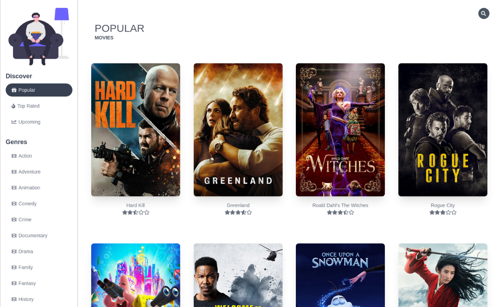

# React Movie Library

I made this library to practice my react skills and to get a better understanding of state management in React.

## Check it out live here - [https://fabmovielibrary.netlify.app](https://fabmovielibrary.netlify.app)



### Techs Used

- [React JS](https://reactjs.org/)
- [React Router](https://github.com/ReactTraining/react-router)
- [Tailwind](https://tailwindcss.com/)

### Features of the Movie Library

- You can discover Popular, top-rated and upcoming movies, browse through different genres of movies to find the one you like.
- Search for your favorite movies.
- Get detailed information for a movie and it's cast.
- Also, you can watch the trailer of the movie.
- Sort out the movies according to vote, popularity, etc.
- Get recommendations for yourself based on the movie you are looking at.
- Visit websites and IMDB profiles of the movie and cast members.
- Get the biography of your favorite cast member and also see other movies they appeared in and so much more!

### Want to run this on your local machine?

- Clone the repo or download the ZIP file.
- Add all the dependencies using `yarn add`. (I have used yarn for development but you can do `npm install` too).
- Add a `.env` file with the following keys (Get your TMDB API from here after signing up and add GA key only if you are integrating Google analytics.)

```
REACT_APP_TMDB_API=your-tmdb-api-key
REACT_APP_GA_KEY=your-google-analytics-tracking-code
```

**In case you do not want to use Google Analytics, just comment out the following two lines from App.js in `/src ` directory.**

```
ReactGA.initialize(process.env.REACT_APP_GA_KEY);
ReactGA.pageview(window.location.pathname + window.location.search);
```

- Now run the command `yarn start` to run the application. (Alternatively, if you are using **npm** run `npm start`).

### API Used

[The Movie DB API](https://www.themoviedb.org/documentation/api) was used for the project, you can sign up for a free account and use it.

<a target="_blank" href="https://www.themoviedb.org/documentation/api">
    
</a>

### Contribution

Please feel free to make a pull request by creating an issue if you feel like there is something which can be improved.

### Author

**[Fab](https://github.com/fabcodingzest)** - _A web developer_
